# 1. Torch按照某个轴求和

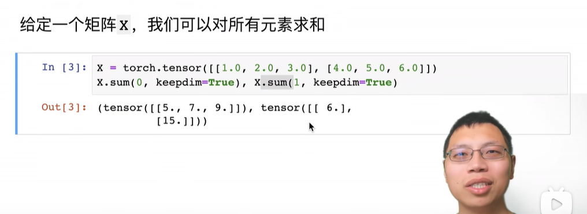

X.sum(0, keepdim=True)

第一个参数是按照第几个维度求和，这里是0，即按照第0维度求和，即第一个中括号后的多个元素求和。如果是1，就按照第2个中括号后的多个元素求和。

第二个参数是是否保持求和的维度，或者是直接消减掉。为true意味着保留维度，即维度的数量保持不变，对应维度的值变化1。

# 2. Benchmark数据读取的时间

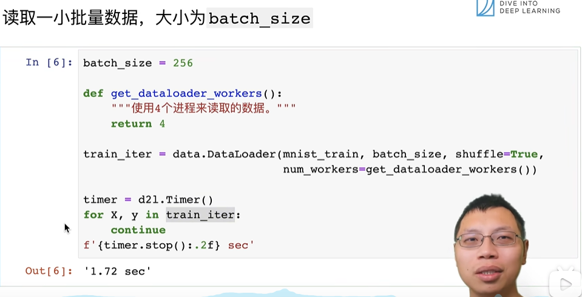

# 3. Huber鲁棒损失

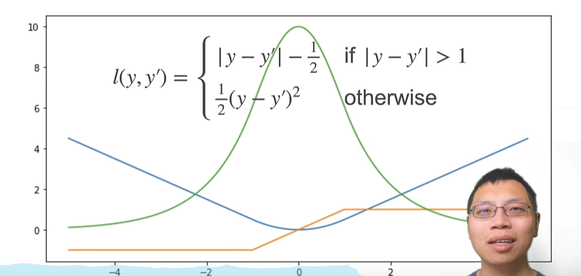

预测值和真实值比较远的时候，梯度不像L2损失那么大，比较均匀

预测值和真实值比较近的时候，梯度也相对平滑变小

综合了绝对值函数和L2函数这俩损失函数的优点

# 4. 交叉熵损失函数

假设y是真实的概率分布，y\_hat是预测的概率分布，他们都是向量，真实的概率分布在某个具体类别上的概率是1，其他类别的概率为0；预测的概率分布每个索引位置的概率是一个0-1的数字，所有索引位置的概率和是1.

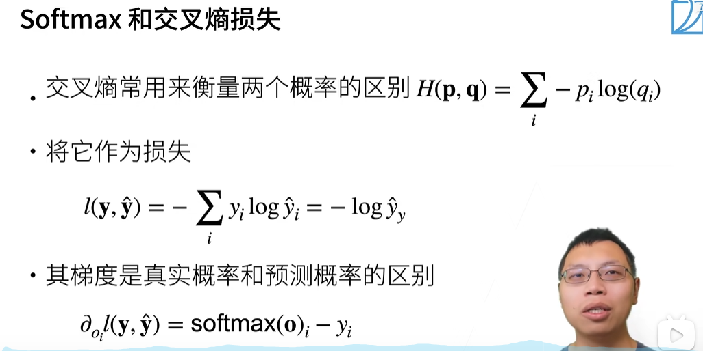

交叉熵可以用来描述真实概率和预测概率的差别，所以一般用交叉熵函数来做分类预测模型的损失函数。其损失就是正确类别的预测概率取自然对数再取负值，如果正确分类的概率为1，则损失为0；

# 5. 定义softmax回归的神经网络模型

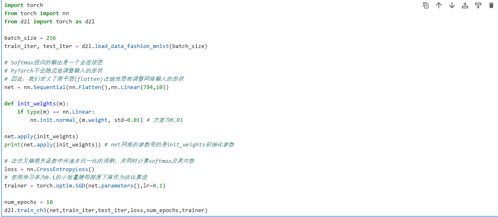

在 PyTorch 中，nn.Sequential 是一个非常方便的模块，用于简化多层神经网络的定义和组合方式。它允许你以有序列表的形式将多个神经网络层按顺序堆叠在一起。这些层会按照你定义的顺序，逐层地将输入数据传递下去。

在这里先先定义了一个展平层，nn.Flatten(), 即将第0维后续的所有维度展开成一层，在这里的逻辑含义就是把每个样本展开成一个向量，正好是长度为784的向量。

接着又定义了一个线性变化层，输入特征数是784，输出特征数是10。

# 6. Soft label训练策略    

指的是用非全0、1的向量来表达真实的分类概率，而是用接近0、1的向量来表达真实的分类概率。是一个小的trick。

在分类预测模型中，使用 Soft Label（软标签） 的训练策略是一种通过概率分布替代传统的 Hard Label（硬标签）（如 one-hot 编码）的优化方法。Soft Label 通过引入更丰富的监督信号和不确定性信息，能够缓解模型过拟合、提升泛化能力，并在知识蒸馏、噪声标签处理、小样本学习等场景中表现优异。

# 7. 感知机模型、线性回归模型、softmax回归模型这几个基础模型的定义、区别

| **特性** | **感知机模型 (Perceptron Model)** | **线性回归模型 (Linear Regression Model)** | **Softmax 回归模型 (Softmax Regression Model)** |
| --- | --- | --- | --- |
| **定义** | 用于二分类任务的线性分类模型，通过学习一个线性分界面来将数据分为两类。 | 用于回归任务的线性模型，通过学习输入特征的线性组合来预测连续值。 | 用于多分类任务的线性分类模型，通过学习一个线性分界面并将输出通过 softmax 函数映射为概率分布。 |
| **任务类型** | 二分类 | 回归 | 多分类 |
| **输出形式** | 离散的类别标签（例如，0 或 1） | 连续值 | 概率分布（每个类别的概率） |
| **数学形式** | *y*=sign(*w*1​*x*1​+*w*2​*x*2​+⋯+*wn*​*xn*​+*b*) | *y*=*w*1​*x*1​+*w*2​*x*2​+⋯+*wn*​*xn*​+*b* | *yj*​=∑*k*=1*K*​*e*(*wk*​⋅*x*+*bk*​)*e*(*wj*​⋅*x*+*bj*​)​ |
| **损失函数** | 误分类损失（基于误分类的样本） | 均方误差（MSE） | 交叉熵损失（Cross-Entropy Loss） |
| **优化算法** | 感知机学习算法（PLA） | 梯度下降（Gradient Descent） | 梯度下降（Gradient Descent） |
| **应用场景** | 二分类问题，如垃圾邮件分类、图像分类等。 | 回归问题，如房价预测、股票价格预测等。 | 多分类问题，如手写数字识别、文本分类等。 |

# 8. 感知机不能你和XOR函数，因为它只能产生线性分割面

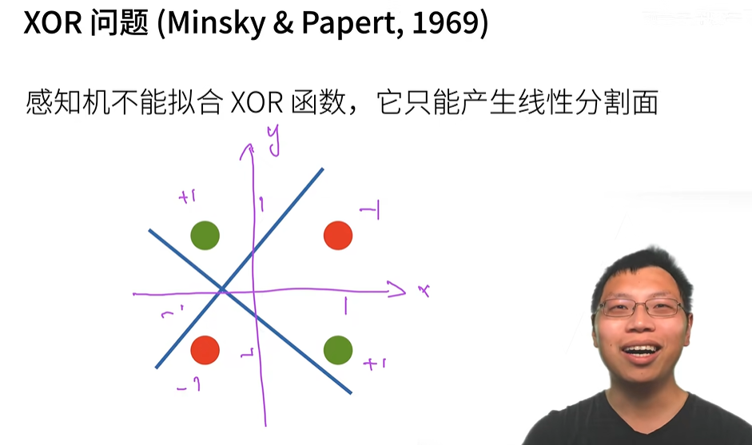

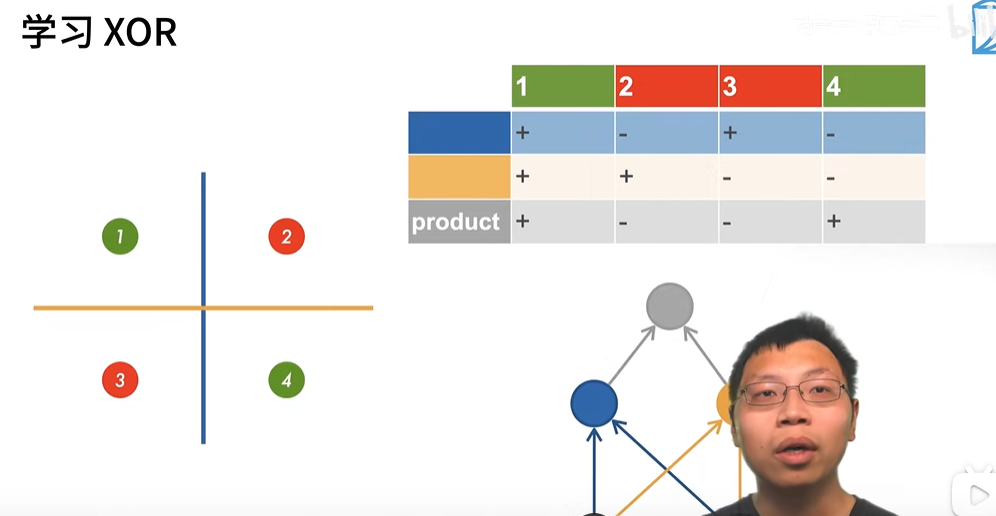

这个事件导致了AI的第一个寒冬！

10年之后发现多层感知机可以解决这个问题！

# 9. 激活函数的意义，为什么需要激活函数

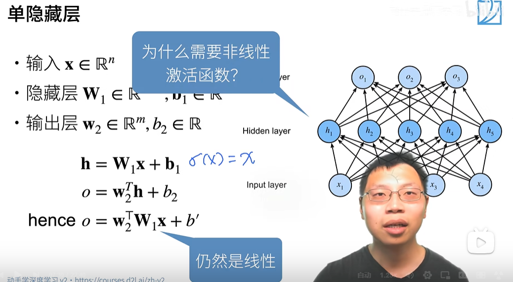

激活函数的本质是引入非线性性！这个超参数的重要性一般，没有隐藏层层数这些超参重要

如果没有非线性的激活函数，隐藏层就没有意义了，合并运算后相当于单层的线性计算

# 10. 常见的激活函数

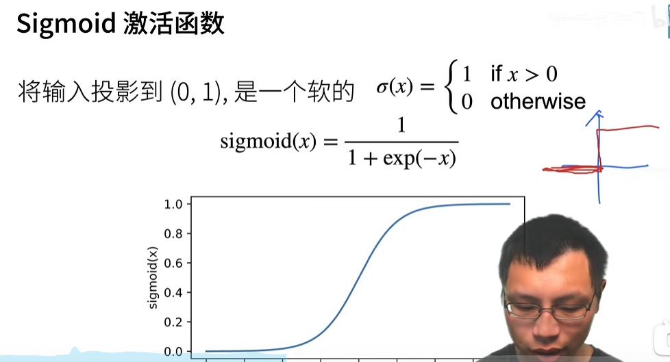

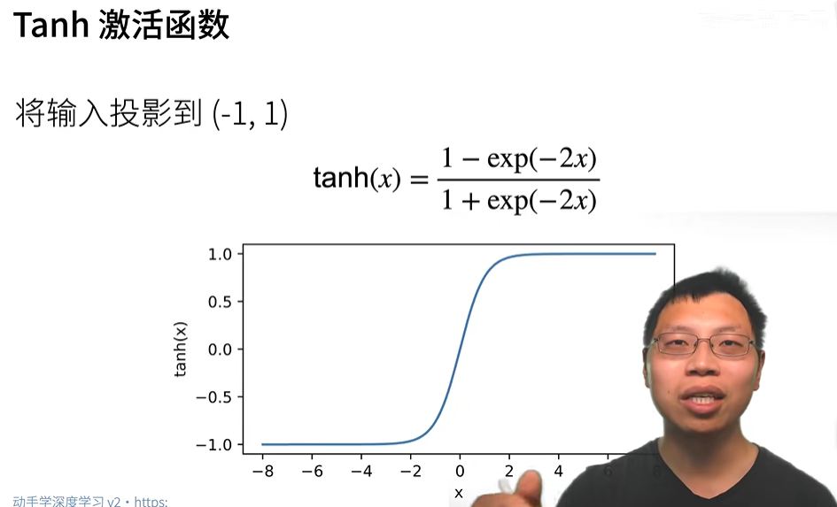

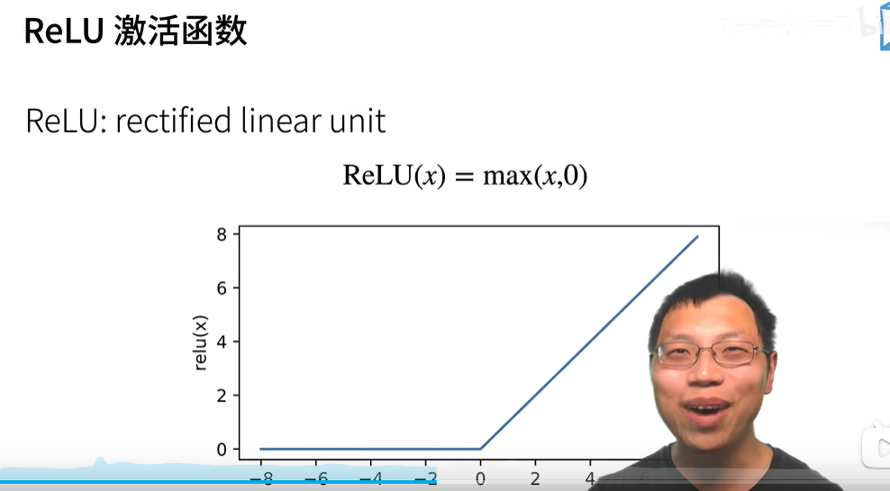

最常见的激活函数是ReLU激活函数，它足够简单，就是把y=x的线性特征稍微打断下即可。他的好处是算起来效率高，相对前面两个激活函数，它不需要做指数运算。

# 11. 对隐藏层的理解和实践方法

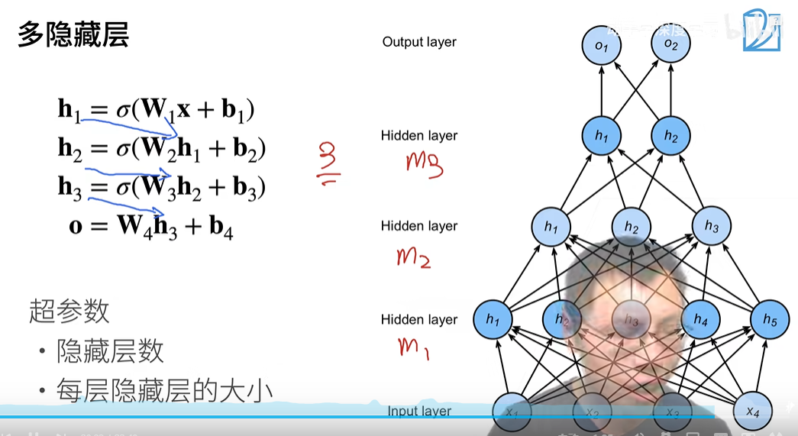

多个隐藏层每一层的大小一般是先扩展下，再逐步压缩。而不是直接压缩到很小的隐藏层，容易损失信息。

# 12. 如何理解神经网络的一层

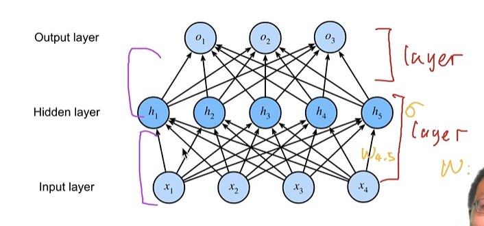

如图，按箭头区分层，这个是两层。即输入层不算层。

# 13. 多层感知机和SVM

两个的效果差不多，SVM的数学性比较好。

但从生产落地的角度，多层感知机方便做实验科学，超参调整。 SVM调整优化器实践起来比较复杂，需要重新设计。

# 14. 是增加隐藏层的层数还是增加隐藏层的神经元个数

优先增加层数，增加层数才是“深度学习”，相对于胖的隐藏层，深度学习更容易训练。

实际上单隐藏层的神经网络可以拟合任何函数，只是你实操时训练不出来

# 15. 隐藏层的实验实践逻辑

李沐给的方法，先不加隐藏层，再加单隐藏层，再加双隐藏层，逐步复杂化

# 16. 训练误差和泛化误差

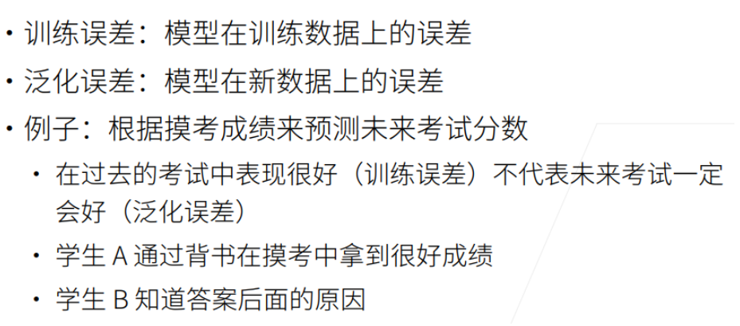

# 17. 验证数据集和测试数据集

验证数据集：用来评估模型好坏的数据集，比如拿出50%的训练数据用作验证数据集

测试数据集：只用一次的新的推理数据集，未来的考试、房子的实际成交价

这里有个有趣的例子

* + - 1. 用imagenet训练的模型，然后到互联网搜索小猫小狗的图片来做验证或者测试数据集，它其实和image net数据集冲突了，因为Image net数据集就是从互联网爬取的
      2. 作弊法，某同学写论文，在测试数据集、训练数据集上做调优，得到一组在训练数据和测试数据集上都ok的参数模型，来发论文

# 18. K则交叉验证

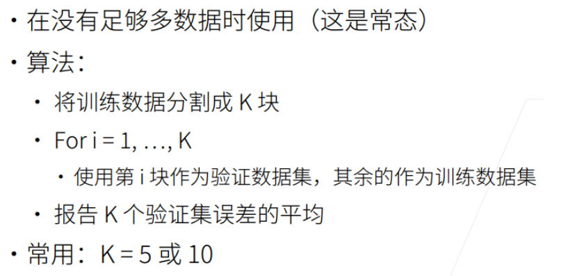

数据集不够的时候，经常用k则交叉验证，大的深度学习网络一般不会用k则交叉验证，代价太高了。

# 19. 模型容量

拟合各种函数的能力，给定一个模型种类，将有2个主要因素影响模型容量：参数个数、参数值的取值范围。不同种类的模型很难比较模型容量。

# 20. 过拟合和欠拟合

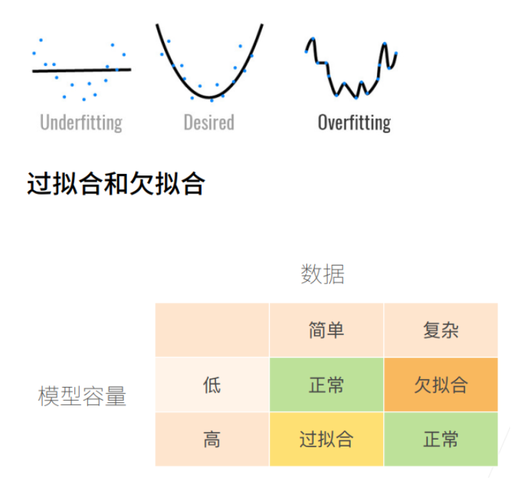

# 21. 模型容量和过拟合、欠拟合的关系

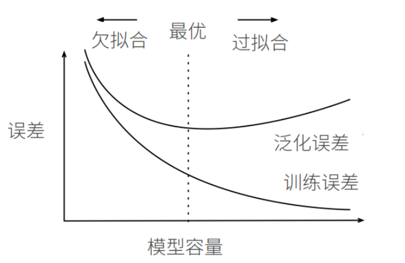

# 22. 数据复杂度

由多个因素决定：样本个数、每个样本的元素个数、多样性、时间/空间属性

# 23. 神经网络的优点

神经网络可以看做一种编程语言，神经网络的可编程性比较好，可扩展性好，可调性好。

不同的layer进行程序化叠加、梯度自动计算

# 24. 一个datasientist百分之八十的时间在搞数据！

# 25. 超参数的定义

模型参数以外的可以选择设置的参数都是超参数，比如模型类型，深度、学习率。

**超参数（Hyperparameter）** 是机器学习和深度学习模型中的一种参数，用于控制模型的训练过程和结构。与模型的 **参数（Parameter）** 不同，超参数不是通过模型的训练过程自动学习得到的，而是由用户在模型训练之前手动设置的。

# 26. 学术界其实是一个时尚界

不同的阶段流行不同的学说，哈哈哈

一波又一波，和编程语言类似

# 27. VC维

一个模型可以完美分类一个数据的复杂度

做一个类比，一个人可以记圆周率小数点后的位数，能记到一百位则认为这个人的VC维是100.

# 28. 很多经典的论文，模型效果很好，一开始找的解释理由都是错的。神经网络其实是一个工程，是一个实验科学，一半工程一半艺术。可能你发现一个好的神经网络模型，背后的why可能50年后有人研究出来了

# 29. 权重衰退是解决模型过拟合的常用方法
      权重衰退的作用
      1.是限制权重的大小，限制模型容量，防止过拟合
      2.提高模型的泛化能力，权重衰退有助于模型在训练数据和测试数据上表现一致，有更好的泛化能力
      3.提高模型的鲁棒性稳定性，较小的权重可以提高数值计算的稳定性，减少数值计算的误差，避免梯度爆炸
      
      为什么名字叫权重衰退？是因为求梯度后做梯度更新时，w(t+1) = (1 - lr * lambda) * w(t) - lr * grad(w)，权重会衰减，所以叫权重衰退。

